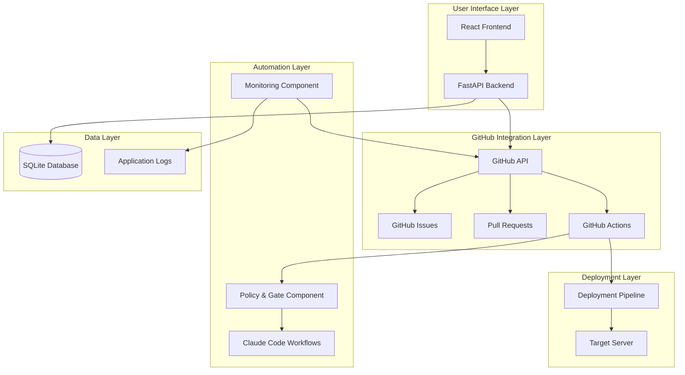
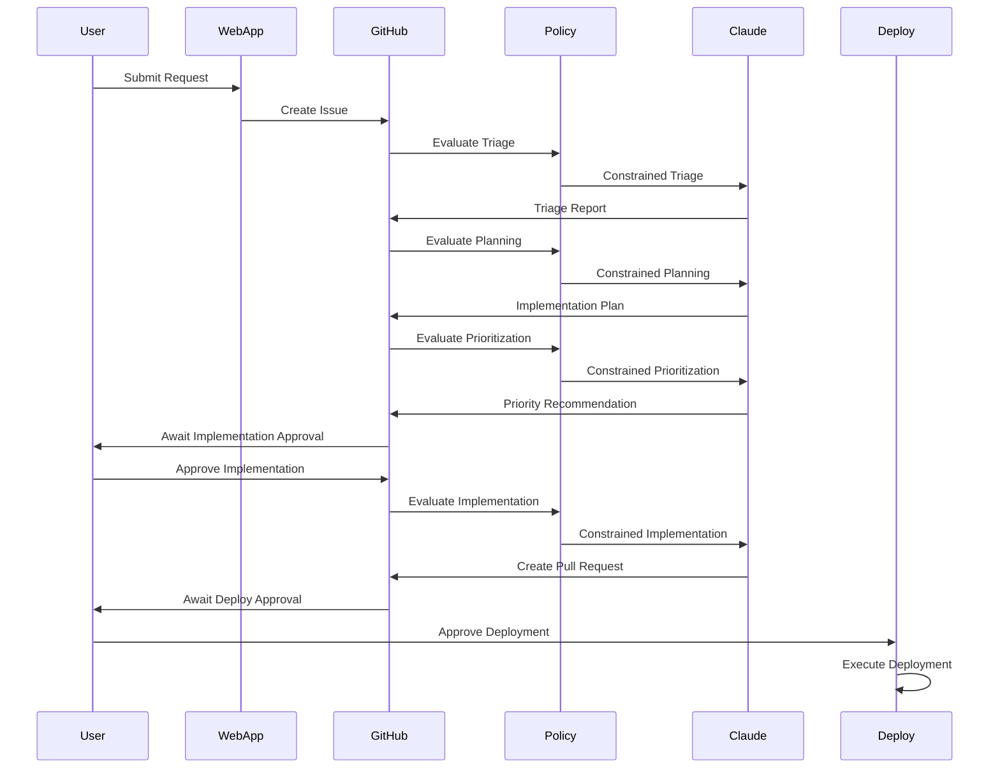
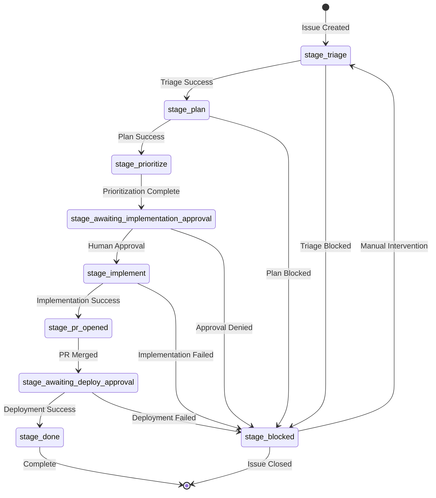

# Design Document: Self-Evolving Web Application

## Overview

The Self-Evolving Web Application is a controlled automation system that implements a feedback loop for continuous improvement. The system accepts user requests and monitoring alerts, processes them through a multi-stage GitHub Actions pipeline using Claude Code, and deploys approved changes with human oversight.

The architecture follows a hub-and-spoke model with GitHub as the central system of record, coordinating between a web application frontend, automated monitoring, workflow orchestration, and deployment components. All state transitions are tracked through GitHub Issues and Pull Requests, providing complete auditability and traceability.

Key design principles include:
- **GitHub as System of Record**: All workflow state, artifacts, and decisions stored in GitHub
- **Human-in-the-Loop**: Explicit approval gates before implementation and deployment
- **Policy-Bounded Automation**: Deterministic policy component constrains all automated actions
- **Test-Driven Development**: All changes include comprehensive testing
- **Fail-Fast Architecture**: Early validation with explicit error handling

## Architecture

### High-Level Architecture



### Component Interaction Flow



## Components and Interfaces

### Web Server Component

**Purpose**: Provides user interface for request submission and administrative operations.

**Technology Stack**:
- Backend: Python FastAPI with SQLAlchemy ORM
- Frontend: React with TypeScript
- Database: SQLite (designed for PostgreSQL migration)
- ASGI Server: uvicorn (development), gunicorn with uvicorn workers (production)

**Key Interfaces**:

```python
# Request Submission API
class RequestSubmissionAPI:
    def submit_bug_report(self, title: str, description: str, severity: str) -> RequestResponse
    def submit_feature_request(self, title: str, description: str, priority: str) -> RequestResponse
    def get_request_status(self, trace_id: str) -> StatusResponse

# Admin Operations API  
class AdminOperationsAPI:
    def list_pending_approvals(self) -> List[ApprovalItem]
    def approve_implementation(self, issue_id: int) -> ApprovalResponse
    def approve_deployment(self, issue_id: int) -> ApprovalResponse
    def get_workflow_status(self, issue_id: int) -> WorkflowStatus
```

**Database Schema**:

```python
class Request(Base):
    __tablename__ = "requests"
    
    id: int = Column(Integer, primary_key=True)
    trace_id: str = Column(String, unique=True, nullable=False)
    github_issue_id: int = Column(Integer, unique=True, nullable=False)
    request_type: str = Column(String, nullable=False)  # bug, feature, investigate
    source: str = Column(String, nullable=False)  # user, monitor
    title: str = Column(String, nullable=False)
    description: str = Column(Text, nullable=False)
    created_at: datetime = Column(DateTime, default=datetime.utcnow)
    updated_at: datetime = Column(DateTime, default=datetime.utcnow, onupdate=datetime.utcnow)

class MonitoringSignature(Base):
    __tablename__ = "monitoring_signatures"
    
    id: int = Column(Integer, primary_key=True)
    signature_hash: str = Column(String, unique=True, nullable=False)
    last_occurrence: datetime = Column(DateTime, nullable=False)
    github_issue_id: int = Column(Integer, nullable=True)
    cooldown_until: datetime = Column(DateTime, nullable=False)
    error_details: str = Column(Text, nullable=False)
```

### Monitoring Component

**Purpose**: Automated detection and reporting of system issues through log analysis.

**Deployment**: Runs as background task within the main FastAPI application process, sharing the same server and SQLite database.

**Key Interfaces**:

```python
class MonitoringComponent:
    def scan_logs(self, since: datetime) -> List[ErrorSignature]
    def compute_signature_hash(self, error: ErrorDetails) -> str
    def check_cooldown(self, signature_hash: str) -> bool
    def create_monitoring_issue(self, error: ErrorSignature) -> GitHubIssue
    def update_signature_tracking(self, signature_hash: str, issue_id: int) -> None

class ErrorSignature:
    signature_hash: str
    error_type: str
    error_message: str
    stack_trace: str
    occurrence_count: int
    first_seen: datetime
    last_seen: datetime
```

**Error Detection Logic**:
- Scan application logs for critical error patterns
- Compute deterministic signature hash from error type + normalized message
- Check cooldown period to prevent duplicate issue creation
- Create GitHub Issue with monitoring labels and error context

### Policy & Gate Component

**Purpose**: Deterministic evaluation of workflow steps with policy-constrained prompt generation.

**Key Interfaces**:

```python
class PolicyGateComponent:
    def evaluate_stage_transition(self, context: StageContext) -> PolicyDecision
    def construct_constrained_prompt(self, stage: str, context: StageContext) -> str
    def validate_implementation_changes(self, changes: ChangeContext) -> PolicyDecision

class StageContext:
    issue_id: int
    current_stage: str
    request_type: str
    source: str
    priority: Optional[str]
    severity: Optional[str]
    trace_id: str
    issue_content: str
    workflow_artifacts: List[str]

class ChangeContext:
    changed_files: List[str]
    diff_stats: DiffStats
    ci_status: str
    test_results: Optional[TestResults]

class PolicyDecision:
    decision: str  # allow, review_required, block
    reason: str
    constructed_prompt: Optional[str]
    constraints: Dict[str, Any]
    timestamp: datetime
```

**Policy Rules Engine**:
- Stage-specific constraints (e.g., triage can only analyze, not implement)
- Change scope limits (e.g., maximum files changed, restricted paths)
- Risk-based escalation (e.g., security-related changes require additional approval)
- Resource constraints (e.g., maximum workflow execution time)

### Workflow Component (GitHub Actions)

**Purpose**: Orchestrates multi-stage processing pipeline using GitHub Actions and Claude Code.

**Workflow Definitions**:

```yaml
# .github/workflows/triage.yml
name: Triage Workflow
on:
  issues:
    types: [labeled]
jobs:
  triage:
    if: contains(github.event.label.name, 'stage:triage')
    runs-on: ubuntu-latest
    steps:
      - name: Policy Gate Evaluation
        run: |
          policy_decision=$(python scripts/policy_gate.py evaluate \
            --stage=triage \
            --issue-id=${{ github.event.issue.number }} \
            --context-file=context.json)
          echo "POLICY_DECISION=$policy_decision" >> $GITHUB_ENV
      
      - name: Execute Triage
        if: env.POLICY_DECISION == 'allow'
        run: |
          claude_response=$(python scripts/claude_integration.py triage \
            --prompt-file=constrained_prompt.txt \
            --issue-id=${{ github.event.issue.number }})
          python scripts/update_issue.py --response="$claude_response"
```

**State Machine Implementation**:
- Label-based state transitions
- Atomic label updates with GitHub API
- Workflow run correlation with Trace_ID
- Error handling and retry logic

### Deployment Component

**Purpose**: Controlled deployment of approved changes with rollback capability.

**Schema Migration**: Claude Code generates Alembic migration scripts for database schema changes, executed during deployment pipeline with validation against production data copies.

**Key Interfaces**:

```python
class DeploymentComponent:
    def create_release(self, git_sha: str) -> ReleaseInfo
    def deploy_release(self, release_info: ReleaseInfo) -> DeploymentResult
    def rollback_release(self, previous_release: str) -> RollbackResult
    def health_check(self) -> HealthStatus

class ReleaseInfo:
    git_sha: str
    release_path: str
    timestamp: datetime
    artifacts: List[str]

class DeploymentResult:
    success: bool
    release_path: str
    previous_release: str
    deployment_time: float
    health_check_result: HealthStatus
```

**Deployment Process**:
1. Create versioned release directory: `/srv/app/releases/{git_sha}/`
2. Install dependencies and build artifacts
3. Run smoke tests and health checks
4. Atomically switch symlink: `/srv/app/current -> releases/{git_sha}/`
5. Restart systemd service
6. Verify deployment success
7. Rollback on failure

## Data Models

### GitHub Artifact Model

The system uses GitHub as the authoritative system of record with the following artifact relationships:

```mermaid
erDiagram
    Issue ||--o{ Comment : has
    Issue ||--o{ Label : tagged_with
    Issue ||--o| PullRequest : resolved_by
    PullRequest ||--o{ WorkflowRun : triggers
    WorkflowRun ||--o{ Comment : creates
    Issue ||--|| TraceID : identified_by
    PullRequest ||--|| TraceID : identified_by
    
    Issue {
        int id PK
        string title
        string body
        string state
        datetime created_at
        datetime updated_at
    }
    
    Label {
        string name PK
        string color
        string description
    }
    
    Comment {
        int id PK
        string body
        string author
        datetime created_at
    }
    
    PullRequest {
        int id PK
        string title
        string body
        string state
        string head_sha
        string base_sha
    }
    
    WorkflowRun {
        int id PK
        string name
        string status
        string conclusion
        datetime created_at
    }
    
    TraceID {
        string id PK
        datetime created_at
    }
```



### Label Taxonomy and State Machine



### Local Database Schema

**Scope**: Operational data for the evolving web application only. GitHub serves as authoritative system of record for all workflow state (Issues, PRs, stage transitions).

```sql
-- Requests table for local tracking
CREATE TABLE requests (
    id INTEGER PRIMARY KEY AUTOINCREMENT,
    trace_id TEXT UNIQUE NOT NULL,
    github_issue_id INTEGER UNIQUE NOT NULL,
    request_type TEXT NOT NULL CHECK (request_type IN ('bug', 'feature', 'investigate')),
    source TEXT NOT NULL CHECK (source IN ('user', 'monitor')),
    title TEXT NOT NULL,
    description TEXT NOT NULL,
    created_at TIMESTAMP DEFAULT CURRENT_TIMESTAMP,
    updated_at TIMESTAMP DEFAULT CURRENT_TIMESTAMP
);

-- Monitoring signatures for deduplication
CREATE TABLE monitoring_signatures (
    id INTEGER PRIMARY KEY AUTOINCREMENT,
    signature_hash TEXT UNIQUE NOT NULL,
    last_occurrence TIMESTAMP NOT NULL,
    github_issue_id INTEGER,
    cooldown_until TIMESTAMP NOT NULL,
    error_details TEXT NOT NULL,
    created_at TIMESTAMP DEFAULT CURRENT_TIMESTAMP
);

-- Policy decisions audit trail
CREATE TABLE policy_decisions (
    id INTEGER PRIMARY KEY AUTOINCREMENT,
    trace_id TEXT NOT NULL,
    stage TEXT NOT NULL,
    decision TEXT NOT NULL CHECK (decision IN ('allow', 'review_required', 'block')),
    reason TEXT NOT NULL,
    constraints TEXT, -- JSON blob
    created_at TIMESTAMP DEFAULT CURRENT_TIMESTAMP,
    FOREIGN KEY (trace_id) REFERENCES requests(trace_id)
);

-- Deployment history
CREATE TABLE deployments (
    id INTEGER PRIMARY KEY AUTOINCREMENT,
    git_sha TEXT NOT NULL,
    release_path TEXT NOT NULL,
    status TEXT NOT NULL CHECK (status IN ('pending', 'success', 'failed', 'rolled_back')),
    deployment_time REAL,
    health_check_result TEXT,
    created_at TIMESTAMP DEFAULT CURRENT_TIMESTAMP
);
```
## Correctness Properties

*A property is a characteristic or behavior that should hold true across all valid executions of a system—essentially, a formal statement about what the system should do. Properties serve as the bridge between human-readable specifications and machine-verifiable correctness guarantees.*

### Property 1: Input Validation and Fail-Fast Behavior
*For any* external input to the system, invalid inputs should be rejected with explicit error messages and the system should never silently fail or degrade functionality.
**Validates: Requirements 0.3**

### Property 2: API Contract Preservation
*For any* existing public API endpoint, the API contract should remain unchanged unless explicitly modified, ensuring backward compatibility.
**Validates: Requirements 0.9**

### Property 3: Request Submission Creates Correct GitHub Issues
*For any* valid user request (bug report or feature request), submitting the request should create a GitHub Issue with the correct labels (`request:bug`/`request:feature`, `source:user`, `stage:triage`) and a unique Trace_ID.
**Validates: Requirements 1.2, 1.3, 1.4, 1.5**

### Property 4: Monitoring Error Detection and Deduplication
*For any* critical error detected in logs, the monitoring component should create a GitHub Issue with correct labels (`request:investigate`, `source:monitor`) only if the error signature is not within its cooldown period.
**Validates: Requirements 2.2, 2.3, 2.4, 2.5**

### Property 5: State Machine Integrity
*For any* Issue in the system, exactly one `stage:*` label should be present at all times, and stage transitions should follow the defined state machine rules.
**Validates: Requirements 3.2, 3.3, 3.4, 3.5**

### Property 6: Workflow Triggering Consistency
*For any* Issue that receives a stage label (`stage:triage`, `stage:plan`, `stage:prioritize`, `stage:implement`), the corresponding workflow should be triggered automatically.
**Validates: Requirements 4.1, 5.1, 6.1, 8.1**

### Property 7: Workflow Output Completeness
*For any* completed workflow (triage, planning, prioritization), the output should contain all required sections and information as specified for that workflow type.
**Validates: Requirements 4.2, 4.3, 5.2, 6.2, 6.3**

### Property 8: Human Approval Gate Enforcement
*For any* workflow stage requiring human approval (implementation, deployment, policy changes), the system should never proceed without explicit Human_Approver authorization.
**Validates: Requirements 7.1, 7.4, 7.5, 11.2, 16.13**

### Property 9: Implementation Workflow Test Requirements
*For any* implementation workflow execution, the workflow should include unit tests for all new or modified code and verify that all tests pass before completion.
**Validates: Requirements 8.3, 8.4**

### Property 10: Pull Request Creation and Linking
*For any* successful implementation, a Pull Request should be created (never direct commits to main) with the Trace_ID in the body and proper Issue reference format (`Fixes #<issue>` or `Refs #<issue>`).
**Validates: Requirements 9.1, 9.2, 9.3, 9.4**

### Property 11: Deployment Atomicity and Rollback
*For any* deployment execution, the deployment should create a versioned release directory, atomically switch the current symlink, and automatically rollback on failure.
**Validates: Requirements 11.3, 11.4, 11.5**

### Property 12: Traceability and Audit Trail
*For any* system artifact (Issue, PR, workflow comment), the Trace_ID should be present and all stage transitions should be recorded with timestamps for complete auditability.
**Validates: Requirements 12.1, 12.2, 12.4, 16.12**

### Property 13: Error Handling and Recovery
*For any* workflow failure, the system should record error details in Issue comments, transition the Issue to `stage:blocked`, and provide retry mechanisms that preserve the original Trace_ID.
**Validates: Requirements 13.1, 13.2, 13.3, 13.4**

### Property 14: Data Persistence and Integrity
*For any* monitoring signature or local data, the information should be stored in the database with proper referential integrity to GitHub artifact IDs.
**Validates: Requirements 14.3, 14.5**

### Property 15: Security Configuration and Logging
*For any* sensitive configuration data, it should be stored in environment variables or secure files (never hardcoded), and all security-relevant events should be logged for audit purposes.
**Validates: Requirements 15.2, 15.5**

### Property 16: Policy & Gate Component Integration
*For any* workflow stage involving Claude (triage, plan, prioritize, implement), the Policy & Gate Component should be invoked first and its decision (`allow`, `review_required`, `block`) should be enforced before proceeding.
**Validates: Requirements 16.1, 16.3, 16.5, 16.8, 16.9, 16.10**

### Property 17: Policy Decision Determinism
*For any* given set of inputs (stage context, artifact context, operational context), the Policy & Gate Component should produce deterministic decisions with clear reasoning and appropriate constraints.
**Validates: Requirements 16.4, 16.6, 16.7**

### Property 18: GitHub API Rate Limiting and Permissions
*For any* GitHub API operation, the system should validate permissions beforehand and respect rate limiting to prevent API abuse.
**Validates: Requirements 15.3, 15.4**

## Error Handling

### Error Categories and Response Strategies

**1. GitHub API Errors**
- **Rate Limiting**: Implement exponential backoff with jitter
- **Authentication Failures**: Fail fast with clear error messages
- **Network Timeouts**: Retry with circuit breaker pattern
- **Permission Errors**: Log security event and block operation

**2. Workflow Execution Errors**
- **Claude API Failures**: Retry with backoff, escalate to human if persistent
- **Policy Gate Failures**: Block workflow and require manual intervention
- **Test Failures**: Block PR creation and record detailed failure information
- **Deployment Failures**: Automatic rollback with notification

**3. Data Consistency Errors**
- **Trace_ID Conflicts**: Generate new Trace_ID and log conflict
- **State Machine Violations**: Force Issue to `stage:blocked` and alert administrators
- **Database Integrity Violations**: Rollback transaction and log error

**4. Security Errors**
- **Invalid Input**: Reject with sanitized error message
- **Permission Violations**: Log security event and deny access
- **Configuration Errors**: Fail startup with clear configuration guidance

### Error Recovery Mechanisms

```python
class ErrorRecoveryManager:
    def handle_workflow_failure(self, issue_id: int, error: Exception) -> None:
        # Record error in Issue comments
        self.github_client.add_issue_comment(
            issue_id, 
            f"Workflow failed: {error}\nTrace_ID: {self.get_trace_id(issue_id)}"
        )
        
        # Transition to blocked state
        self.github_client.set_issue_labels(issue_id, ["stage:blocked"])
        
        # Enable retry mechanism
        self.enable_retry_option(issue_id)
    
    def handle_deployment_failure(self, release_info: ReleaseInfo) -> None:
        # Automatic rollback
        previous_release = self.get_previous_release()
        self.deployment_component.rollback_release(previous_release)
        
        # Notify administrators
        self.notification_service.alert_deployment_failure(release_info)
```

## Testing Strategy

### Dual Testing Approach

The system requires both unit testing and property-based testing for comprehensive coverage:

**Unit Tests**: Focus on specific examples, edge cases, and integration points
- API endpoint behavior with specific inputs
- Database operations with known data
- Error conditions and boundary cases
- Component integration scenarios

**Property Tests**: Verify universal properties across all inputs
- Input validation across all possible inputs
- State machine transitions for all valid state combinations
- Workflow behavior across all request types
- Traceability across all system artifacts

### Property-Based Testing Configuration

**Testing Framework**: Use Hypothesis (Python) for property-based testing
- Minimum 100 iterations per property test
- Custom generators for domain-specific data types
- Shrinking enabled for minimal failing examples

**Test Organization**:
```python
# Example property test structure
@given(
    request_type=st.sampled_from(['bug', 'feature']),
    title=st.text(min_size=1, max_size=100),
    description=st.text(min_size=1, max_size=1000)
)
def test_request_submission_creates_correct_issue(request_type, title, description):
    """
    Feature: self-evolving-app, Property 3: Request Submission Creates Correct GitHub Issues
    
    For any valid user request, submitting should create GitHub Issue with correct labels and Trace_ID
    """
    # Test implementation
    pass
```

**Test Tagging**: Each property test must reference its design document property:
- Format: `Feature: self-evolving-app, Property {number}: {property_text}`
- Links test execution to design requirements
- Enables traceability from test failures to requirements

### Unit Testing Balance

Unit tests complement property tests by focusing on:
- **Specific Examples**: Known good/bad inputs and expected outputs
- **Edge Cases**: Boundary conditions and corner cases
- **Integration Points**: Component interactions and API contracts
- **Error Scenarios**: Specific failure modes and recovery paths

Avoid excessive unit testing of behaviors already covered by property tests. Property tests handle comprehensive input coverage, while unit tests verify specific scenarios and integration behavior.

### Test Environment Setup

**GitHub Actions Testing**: Extract complex logic into testable Python modules, use `act` for local workflow testing, mock GitHub API responses for unit tests, maintain test repository for end-to-end validation.

**Local Development**:
- SQLite in-memory database for fast test execution
- Mock GitHub API responses for deterministic testing
- Test-specific configuration isolation

**CI/CD Pipeline**:
- Full test suite execution on every PR
- Property test results with shrunk examples on failure
- Test coverage reporting with minimum thresholds
- Integration tests against GitHub API (rate-limited)

**Test Data Management**:
- Factories for generating test data
- Fixtures for common test scenarios
- Cleanup procedures for test isolation